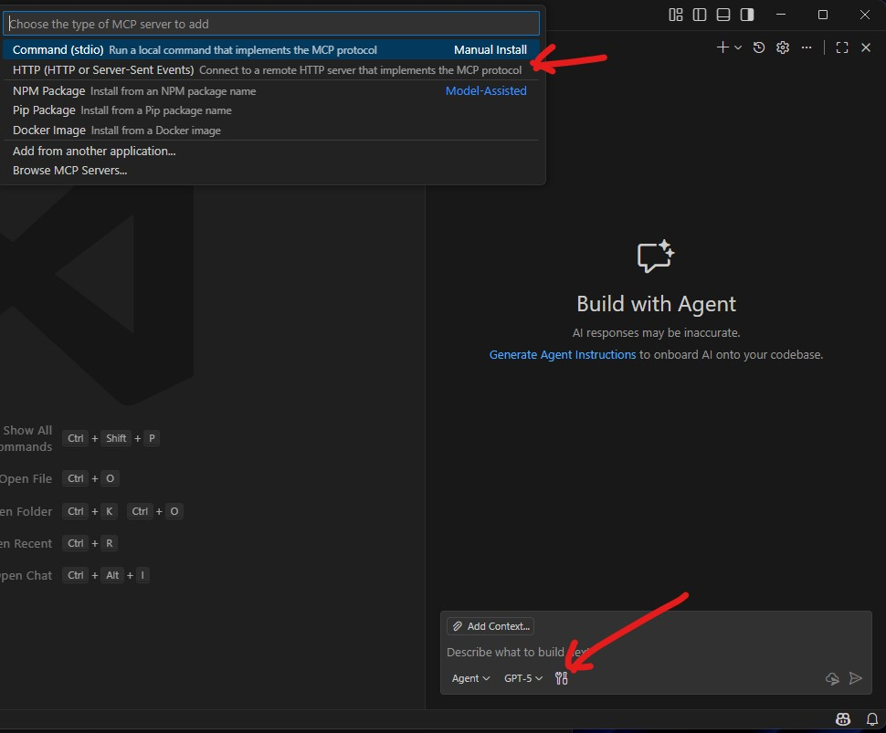

# MCP Server demo

The goal of this project is showing how to build a MCP server by using .NET

## Scenario
The use case scenario is managing information stored into Postgres database about customers, products and orders.

The MCP server provides the data on behalf of user prompt like:
```shell
    give me the customer list
    tell me the most expensive order
    how many USB-C Hub has been ordered ?
    give me the customer list without orders
    suggest a new product for the customer Jane Smith
    add new order
    .....
```

## Setup and run

Prerequisites:
- [DOTNET 10 SDK](https://dotnet.microsoft.com/)
- [VSCODE](https://code.visualstudio.com/)
- [DOCKER](https://www.docker.com/)


1) Define the environment's parameters by replacing user and password information in __.env__ and properties file located into the setup folder:
```
ENV_NAME=DemoMCP

NGINX_RELEASE=1.29.3
NGINX_HOSTPORT=8081

POSTGRES_RELEASE=18.1
POSTGRES_USER=<<postgres-user-here>>
POSTGRES_PASSWORD=<<postgres-password-here>>
POSTGRES_DB=demomcp

PGADMIN_RELEASE=9.10.0
PGADMIN_EMAIL=<<pgadmin-user-here>>
PGADMIN_PASSWORD=<<pgadmin-password-here>>
```

2) Create into the folder setup/config/nginx/certs the server certification files for nginx with following command:
```shell
openssl req -x509 -newkey rsa:4096 -sha256 -days 365 -nodes -keyout ./config/nginx/certs/server.key -out ./config/nginx/certs/server.crt -subj '/CN=localhost'
```

3) Set the ConnectionStrings in __appsettings.Development.json__ file located into src/ folder (use the same postgres credential info used on step 1):
```json
{
  "Logging": {
    "LogLevel": {
      "Default": "Information",
      "Microsoft.AspNetCore": "Warning"
    }
  },
  "ConnectionStrings": {
    "Default": "Host=localhost;Database=demomcp;Username=<<postgres-user-here>>;Password=<<postgres-password-here>>"
  }
}
```

4) Spin up the evironment with docker compose:
```shell
user@PC:cd setup
user@PC:docker-compose up -d

user@PC:~/DemoMCP/setup$ docker-compose up -d
Creating network "DemoMCP_frontend" with the default driver
Creating network "DemoMCP_backend" with the default driver
Creating DemoMCP_db    ... done
Creating DemoMCP_nginx ... done
Creating DemoMCP_pgadmin ... done
```

5) Start the MCPServer application
```shell
user@PC:cd src/
user@PC:dotnet run

user@PC:~/DemoMCP/src/MCPServer$ dotnet run
Using launch settings from /home/adimo/workspaces/DemoMCP/src/MCPServer/Properties/launchSettings.json...
Building...
info: Microsoft.Hosting.Lifetime[14]
      Now listening on: http://localhost:5186
info: Microsoft.Hosting.Lifetime[0]
      Application started. Press Ctrl+C to shut down.
info: Microsoft.Hosting.Lifetime[0]
      Hosting environment: Development
info: Microsoft.Hosting.Lifetime[0]
      Content root path: /home/adimo/workspaces/DemoMCP/src/MCPServer
```

6) To use the MCP Server you need to register it to VSCODE by using the endpoint __http://localhost:5186__
Access to pgadmin at the endpoint __https://localhost/pgadmin__ and use the credentials defined into .env file


